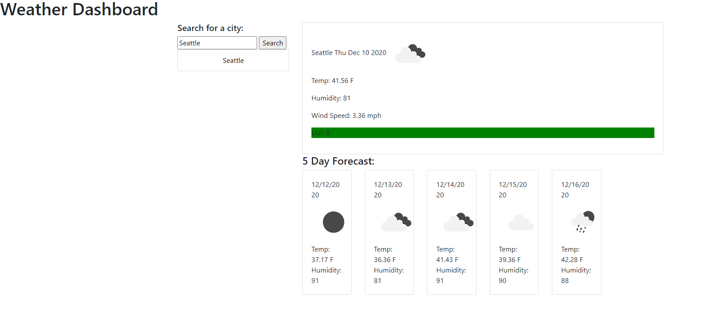
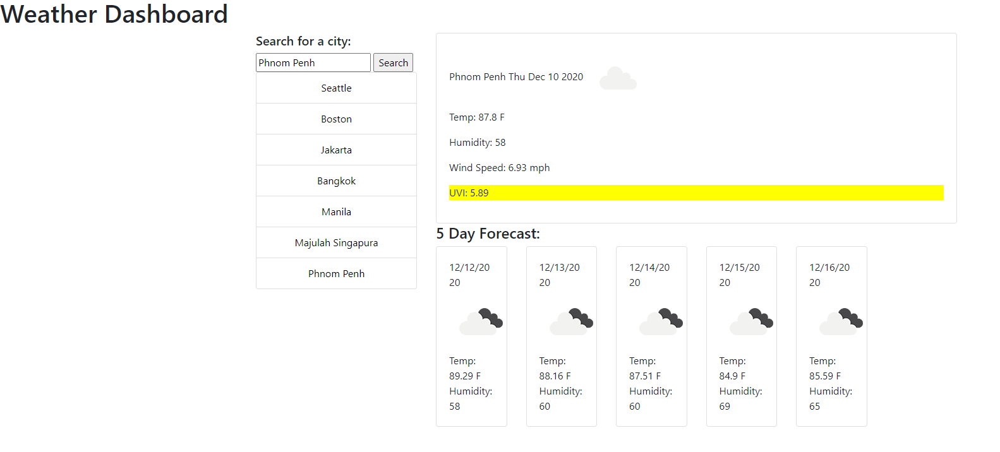
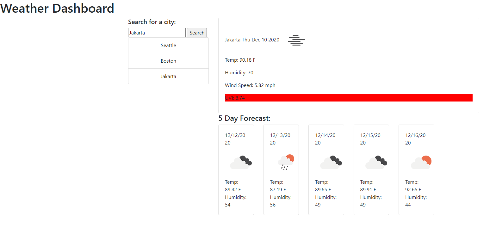

# Weather_Dashboard

GitHub Repository: https://github.com/wilbur125/Weather_Dashboard 
Git Page: https://wilbur125.github.io/Weather_Dashboard/ 

This app allows users to search for current weather and future five day forecast. Past searches will populate and save in local storage when the user returns. The UV Index will show as a color for favorable, moderate, or sever conditions. Those colors are green, yellow, and red respectively.

